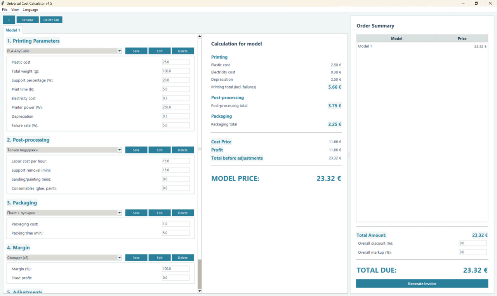
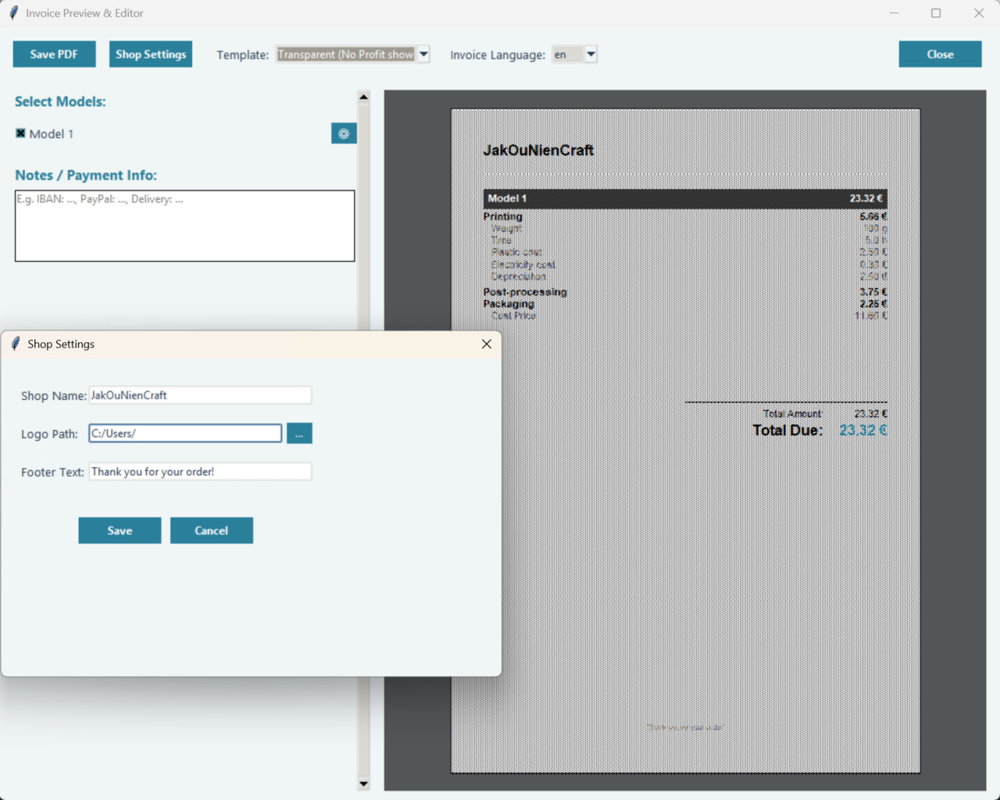
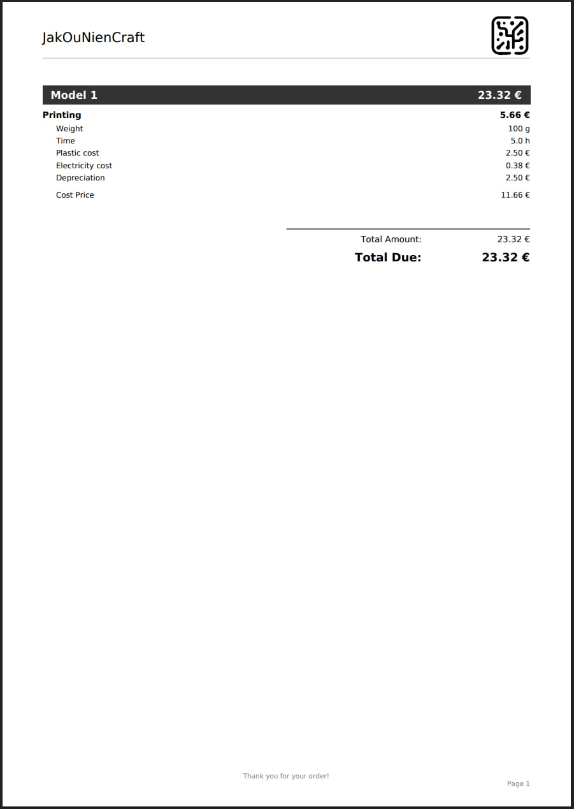

# 3D Printing Cost Calculator 🖨️💰

A fully-featured, multilingual desktop application built for 3D printing enthusiasts and small farm owners. It helps you accurately track printing costs, factor in your labor, and generate professional PDF invoices for clients.

**Note:** This project was entirely created using AI (Vibecoding / Prompt Engineering). I acted as the architect and prompt engineer, designing the logic, interface, and assembling the final product.

## 🎯 Who is this for?
* **Hobbyists** who want to know the real cost of their prints (including electricity, failure rates, and printer depreciation).
* **3D Printing Businesses** needing a fast way to calculate margins, add markups, and send receipts.

## ✨ Key Features
* **Detailed Economics:** Calculates costs for filament, power, post-processing (sanding/support removal), and packaging.
* **Smart PDF Invoices:** Preview and customize your receipts before saving. Generates clean, professional documents directly from your calculation.

* **Custom Presets:** Save your favorite filaments and hourly rates for one-click access.
* **Multilingual:** Interface translates instantly via the menu.
* **Smart Setup:** The built-in launcher automatically downloads required libraries (Pillow, ReportLab) and fonts on the first run.

## 🚀 How to Run
Requires **Python 3.7+**.

### 🪟 Windows:
1. Download the latest `.zip` from the **Releases** tab on the right.
2. Extract the folder and run `cost_calculator.exe`.
*(Or clone this repository and double-click `start.bat`)*

### 🍎 Mac / 🐧 Linux:
1. Download the Source code from the **Releases** tab.
2. Extract the folder.
3. Open a terminal in the folder and run:
   `python launcher.py`
